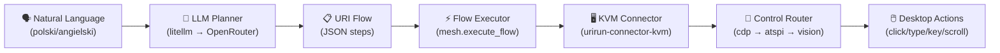
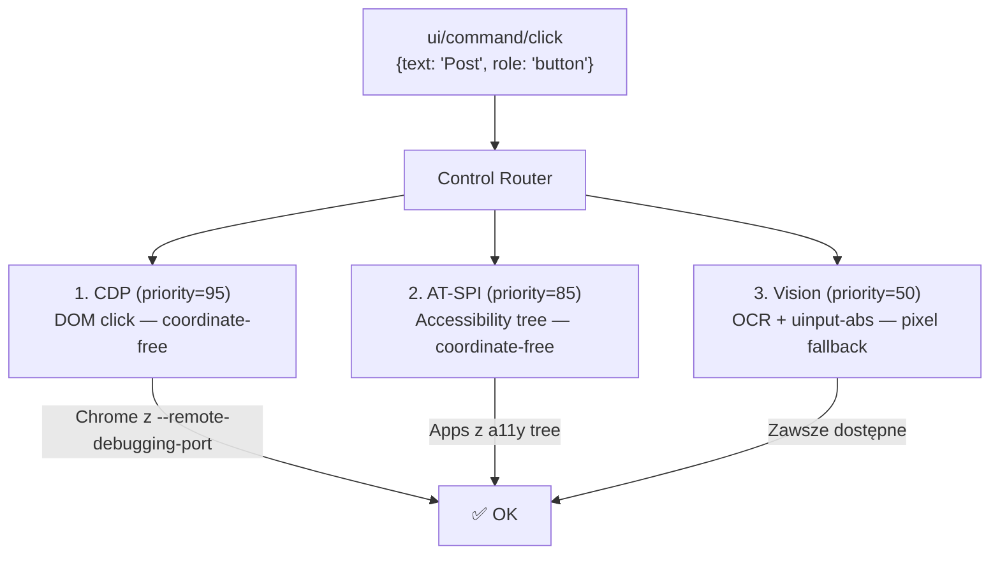

# NL → URI → urirun Desktop Environment — Analiza Automatyzacji

## Odpowiedź: TAK — to już działa, i to trzema ścieżkami

Automatyzacja **NL → URI → Desktop Environment** jest nie tylko możliwa — **jest już zaimplementowana** i działająca w trzech wariantach:

---

## 1. Architektura pełnego pipeline'u



Pipeline jest w pełni end-to-end:

| Warstwa | Komponent | Plik źródłowy |
|---------|-----------|---------------|
| **NL Input** | Chat prompt (tekst) | Dashboard UI / API |
| **Planning** | `llm_flow()` / `heuristic_flow()` | [flow.py](../urirun/adapters/python/urirun/node/flow.py#L343-L416) |
| **Normalization** | `normalize_flow()` | [flow.py](../urirun/adapters/python/urirun/node/flow.py#L301-L340) |
| **Execution** | `execute_flow()` | [flow.py](../urirun/adapters/python/urirun/node/flow.py#L531-L571) |
| **Control Router** | `route()` cdp→atspi→vision | [control.py](../urirun-connector-kvm/urirun_connector_kvm/control.py#L159-L200) |
| **Input Backend** | ydotool / uinput-absolute | [backends.py](../urirun-connector-kvm/urirun_connector_kvm/backends.py) |

---

## 2. Trzy ścieżki automatyzacji

### Ścieżka A: Chat Dashboard (produkcyjna)

```
NL prompt → /api/chat/ask → discover_mesh → make_flow → execute_flow → results
```

- **Endpoint**: `POST http://127.0.0.1:8194/api/chat/ask`
- **Plik**: [host_dashboard.py:_chat_ask_general](../urirun/adapters/python/urirun/host/host_dashboard.py#L10240-L10342)
- **Status**: ✅ Działa — właśnie opublikowaliśmy post na LinkedIn tą drogą

```json
{
  "prompt": "napisz na laptopie lenovo na linkedin post i opublikuj",
  "nodes": ["lenovo"],
  "targets": ["host", "node:lenovo"],
  "execute": true
}
```

> [!TIP]
> Ta ścieżka automatycznie: odkrywa mesh → planuje flow via LLM → waliduje URI → wykonuje krokowo z recovery

### Ścieżka B: CLI Planner (`examples/47-nl-desktop-control/run.py`)

```
NL → dedykowany system prompt z ACTION SPACE → LLM plan → sekwencyjne URI calls
```

- **Plik**: [run.py](../examples/47-nl-desktop-control/run.py)
- **Status**: ✅ Działa
- **Zaleta**: Dedykowany system prompt (`perceive→act→verify`) + screenshot po każdym kroku

```bash
python run.py "open the LinkedIn composer and draft a post" \
  --node http://192.168.188.201:8765 --execute \
  --save-shots ~/.urirun/artifacts/kvm-laptop
```

### Ścieżka C: Computer Use Agent Loop (`computer_use.py`)

```
screenshot → VLM grounding model → normalized action → execute → screenshot → repeat
```

- **Plik**: [computer_use.py](../examples/47-nl-desktop-control/computer_use.py)
- **Status**: ✅ Działa (z kalibracją)
- **Model**: Wymaga VLM z computer-use capability (Gemini 3.5 Flash / Claude Computer Use)
- **Cechy**: Closed-loop (obserwuje rezultat każdej akcji), human-in-the-loop na irreversible actions

```bash
python computer_use.py calibrate                  # jednorazowo
python computer_use.py run "open LinkedIn, create a post about AI automation"
```

---

## 3. Action Space dostępny dla LLM

Trasy KVM connectora, które LLM może wykorzystać w planach:

| URI | Opis | Strategia |
|-----|------|-----------|
| `kvm://{node}/ui/command/click` | Znajdź element i kliknij | cdp → atspi → vision |
| `kvm://{node}/ui/command/fill` | Znajdź pole, fokus, wpisz wartość | cdp → atspi → vision |
| `kvm://{node}/ui/query/wait` | Czekaj aż element pojawi się na ekranie | cdp → atspi → vision |
| `kvm://{node}/ui/query/find` | Zlokalizuj element (bez akcji) | cdp → atspi → vision |
| `kvm://{node}/ui/query/verify` | Sprawdź czy tekst jest na ekranie | vision OCR |
| `kvm://{node}/ui/command/click-text` | OCR → kliknij tekst (starsza wersja) | vision only |
| `kvm://{node}/input/command/type` | Wpisz tekst (do aktywnego pola) | ydotool / uinput |
| `kvm://{node}/input/command/key` | Wyślij klawisz/kombinację | ydotool / uinput |
| `kvm://{node}/input/command/click` | Kliknij w koordynatach x,y | uinput-absolute |
| `kvm://{node}/input/command/wait` | Pauza (odczekaj N sekund) | sleep |
| `kvm://{node}/screen/query/capture` | Zrób screenshot | grim / scrot |
| `app://{node}/desktop/command/launch` | Uruchom aplikację desktopową | XDG / open |

---

## 4. Control Router — 3-warstwowy fallback



> [!IMPORTANT]
> Router automatycznie próbuje od najlepszej strategii do najgorszej. CDP jest najniezawodniejsze (działa przez DOM), ale wymaga Chrome z `--remote-debugging-port`.

---

## 5. Aktualne ograniczenia i jak je rozwiązać

### Problem 1: OCR na ciemnym motywie
**Objaw**: Tesseract nie rozpoznaje tekstu na ciemnym tle LinkedIn  
**Rozwiązanie**: Użyj strategii CDP (Chrome z `--remote-debugging-port=9222`) — click przez DOM, nie OCR

### Problem 2: Język interfejsu vs język promptu
**Objaw**: LLM generuje polskie nazwy przycisków ("Opublikuj"), a UI jest angielski ("Post")  
**Rozwiązanie**: Prompt powinien zawierać hint o języku UI, lub LLM powinien robić screenshot-verify

### Problem 3: Koordynaty na Wayland multi-monitor / HiDPI
**Objaw**: `ydotool` absolute positioning nie mapuje się na pixele screenshota  
**Rozwiązanie**: Uinput-absolute device (już zaimplementowany w `abs/command/click`) + kalibracja

### Problem 4: Brak closed-loop verification w ścieżce A (chat)
**Objaw**: `make_flow` generuje plan jednorazowo, nie obserwuje rezultatu po każdym kroku  
**Rozwiązanie**: Integracja `computer_use.py` agentic loop z chat dashboard

---

## 6. Rekomendowane ulepszenia

### Natychmiastowe (low-hanging fruit)

1. **Uruchom Chrome z CDP** na laptopie Lenovo:
   ```bash
   google-chrome --remote-debugging-port=9222
   ```
   → Control router automatycznie użyje CDP zamiast OCR — **rozwiązuje problem 1 i 2**

2. **Dodaj `--lang=en` hint** do system promptu LLM planner:
   ```python
   # w llm_flow() system message
   "The target desktop UI is in English. Use English element names (e.g. 'Post', not 'Opublikuj')."
   ```

### Średnioterminowe

3. **Zintegruj agentic loop** (computer_use.py) z chat dashboard jako alternatywny executor:
   - Ścieżka A generuje plan jednorazowo (open-loop)
   - Ścieżka C obserwuje po każdym kroku (closed-loop)
   - Hybrid: plan via LLM, ale z verify po każdym kroku

4. **Auto-detect UI language** via screenshot OCR przed planowaniem

### Długoterminowe

5. **Dedykowany computer-use model** (Gemini 3.5 Flash computer_use) zamiast generic text LLM do grounding
6. **Flow recording + replay** — nagraj successful flow i replay bez LLM

---

## 7. Podsumowanie

| Cecha | Status |
|-------|--------|
| NL → URI flow planning | ✅ Działa (LLM + heuristic fallback) |
| URI → Desktop execution | ✅ Działa (KVM connector) |
| Multi-strategy control | ✅ CDP → AT-SPI → Vision |
| Chat dashboard integration | ✅ `/api/chat/ask` |
| CLI automation | ✅ `run.py` |
| Computer-use agent loop | ✅ `computer_use.py` |
| Recovery/retry | ✅ Automatic retry on transient errors |
| Human-in-the-loop | ✅ Safety stop on irreversible actions |
| Cross-node mesh | ✅ Host → multiple nodes |
| Screenshot artifacts | ✅ Per-step screenshots |

**Pełny pipeline NL → URI → Desktop Environment już istnieje i działa.** Główna poprawa to uruchomienie CDP (Chrome DevTools Protocol) na docelowym node, co eliminuje problemy z OCR i daje coordinate-free, role-exact interakcję z przeglądarką.
