# System Architecture Analysis
<!-- generated in 0.00s -->

## Overview

- **Project**: /home/tom/github/if-uri/urirun-connector-kvm
- **Primary Language**: python
- **Languages**: python: 19, shell: 3, yaml: 3, toml: 1, json: 1
- **Analysis Mode**: static
- **Total Functions**: 321
- **Total Classes**: 11
- **Modules**: 29
- **Entry Points**: 233

## Architecture by Module

### urirun_connector_kvm.backends
- **Functions**: 79
- **Classes**: 2
- **File**: `backends.py`

### urirun_connector_kvm.core
- **Functions**: 58
- **File**: `core.py`

### computer-use-preview.computers.playwright.playwright
- **Functions**: 33
- **Classes**: 1
- **File**: `playwright.py`

### computer-use-preview.computers.kvm.kvm
- **Functions**: 33
- **Classes**: 1
- **File**: `kvm.py`

### computer-use-preview.computers.computer
- **Functions**: 27
- **Classes**: 2
- **File**: `computer.py`

### computer-use-preview.agent
- **Functions**: 21
- **Classes**: 1
- **File**: `agent.py`

### urirun_connector_kvm.cdp
- **Functions**: 18
- **File**: `cdp.py`

### urirun_connector_kvm.launch_backends
- **Functions**: 16
- **File**: `launch_backends.py`

### urirun_connector_kvm.strategies
- **Functions**: 14
- **Classes**: 3
- **File**: `strategies.py`

### urirun_connector_kvm.control
- **Functions**: 9
- **File**: `control.py`

### examples.calibrate_abs
- **Functions**: 4
- **File**: `calibrate_abs.py`

### computer-use-preview.computers.browserbase.browserbase
- **Functions**: 3
- **Classes**: 1
- **File**: `browserbase.py`

### urirun_connector_kvm.environment
- **Functions**: 3
- **File**: `environment.py`

### urirun_connector_kvm.surface
- **Functions**: 2
- **File**: `surface.py`

### computer-use-preview.main
- **Functions**: 1
- **File**: `main.py`

## Key Entry Points

Main execution flows into the system:

### urirun_connector_kvm.core.task_run
> Execute an ordered list of ``{op, ...}`` steps in one call (so a focus→click→
type→submit flow shares the same ydotoold session). ops: focus, move, cl
- **Calls**: conn.handler, urirun_connector_kvm.core._ok, str, st.get, log.append, time.sleep, time.sleep, log.append

### urirun_connector_kvm.backends._locate_easyocr
> OCR-locate via EasyOCR (CRAFT detector + CRNN) — stronger than tesseract on UI
fonts, low contrast, and non-Latin scripts, with no a11y permissions. R
- **Calls**: urirun_connector_kvm.backends.backend, None.strip, urirun_connector_kvm.backends._easyocr_reader, reader.readtext, q.lower, matches.sort, urirun_connector_kvm.backends._capture_tmp, float

### urirun_connector_kvm.environment.profile
> Capabilities of the current session, plus a derived ``controlStrategies`` map saying
which router strategy CAN work here (cdp needs a reachable debug 
- **Calls**: urirun_connector_kvm.environment._safe, any, urirun_connector_kvm.environment.atspi_ready, B.have_mod, urirun_connector_kvm.environment._safe, B._screen_wh, B.platform_tag, B.is_wayland

### urirun_connector_kvm.core.ui_click_text
> Close the perceive→locate→act loop in one call: screenshot, OCR-locate ``text``,
move+click its center via KVM, then optionally type ``then_type`` and
- **Calls**: conn.handler, urirun_connector_kvm.core._ok, urirun.fail, urirun_connector_kvm.core._capture_native, B.dispatch, loc.get, urirun.fail, min

### urirun_connector_kvm.core.window_restore
> Inverse of window/command/close: navigate to the snapshot URL, then rehydrate scroll and
form values (dispatching input/change so React/contenteditabl
- **Calls**: conn.handler, None.replace, urirun_connector_kvm.core._cdp_mod, urirun_connector_kvm.core._ok, s.get, urirun.fail, _json.dumps, cdp.navigate

### urirun_connector_kvm.core.proc_kill
> Send a signal to a process so process lifecycle is controllable *via a URI*, not a
side-channel shell — e.g. close a stray CDP/headless browser or res
- **Calls**: conn.handler, getattr, urirun_connector_kvm.core._ok, signal.startswith, len, urirun.fail, int, urirun.fail

### urirun_connector_kvm.backends._locate_vql
- **Calls**: urirun_connector_kvm.backends.backend, urirun_connector_kvm.backends._capture_tmp, urirun_connector_kvm.backends._run, _json.loads, None.lower, BackendError, None.get, layer.get

### computer-use-preview.agent.BrowserAgent._dispatch_legacy_action
> Dispatch a legacy action by name.
- **Calls**: ValueError, bc.click_at, bc.hover_at, bc.type_text_at, bc.scroll_document, self._handle_scroll_at, self._handle_drag_and_drop, bc.navigate

### urirun_connector_kvm.core.ui_wait
- **Calls**: conn.handler, max, time.monotonic, urirun.fail, min, C.route, last.get, time.sleep

### urirun_connector_kvm.core.cdp_ensure
> Make the CDP control surface AVAILABLE — LAUNCH/PROBE SPLIT so Chrome's cold-start
can't blow the node handler's exec cap. Reuses a live endpoint, els
- **Calls**: conn.handler, urirun_connector_kvm.core._cdp_mod, _cdp.start_session, r.get, r.get, _cdp.await_ready, r.get, urirun_connector_kvm.core._ok

### urirun_connector_kvm.core.capture
> Capture the live screen via the best available backend. ``max_width`` downscales
(so coords map 1:1 to a logical screen on HiDPI); ``base64`` returns 
- **Calls**: conn.handler, urirun.tag, os.path.join, B.dispatch, urirun_connector_kvm.core._apply_capture_postprocessing, res.get, res.get, urirun_connector_kvm.core._ok

### urirun_connector_kvm.core.ui_act
> ONE high-level URI an LLM planner can target instead of hand-assembling
wait+find+click+verify (which it gets wrong: dumb sleeps, OCR label guesses, n
- **Calls**: conn.handler, urirun_connector_kvm.core._act_reject, urirun_connector_kvm.core._resolve_act_app, time.monotonic, urirun_connector_kvm.core._act_ready, urirun_connector_kvm.core._act_retry_loop, urirun.fail, last.get

### computer-use-preview.computers.kvm.kvm.KvmComputer._run
- **Calls**: None.encode, urllib.request.Request, env.get, urllib.request.urlopen, json.loads, env.get, RuntimeError, isinstance

### computer-use-preview.agent.BrowserAgent._dispatch_action
> Dispatch a non-legacy action by name.
- **Calls**: ValueError, self.denormalize_x, self.denormalize_y, self._handle_scroll_at, self._handle_drag_and_drop, bc.type_text, bc.wait, bc.navigate

### urirun_connector_kvm.backends._locate_tesseract
> OCR-locate on-screen text. Unlike a saliency detector this GENUINELY matches the
query against recognised text, so it is preferred (priority 65 > imgl
- **Calls**: urirun_connector_kvm.backends.backend, None.strip, urirun_connector_kvm.backends._run, q.lower, urirun_connector_kvm.backends._capture_tmp, sorted, urirun_connector_kvm.backends._tesseract_query_matches, len

### computer-use-preview.agent.BrowserAgent.run_one_iteration
- **Calls**: self._generate_response, self.get_text, self.extract_function_calls, self._render_turn, self._execute_function_calls, self._contents.append, self._trim_old_screenshots, print

### computer-use-preview.main.main
- **Calls**: argparse.ArgumentParser, parser.add_argument, parser.add_argument, parser.add_argument, parser.add_argument, parser.add_argument, parser.add_argument, parser.add_argument

### urirun_connector_kvm.core.display_info
> The display geometry callers need without taking a screenshot: full pixel size (the
space capture and click coordinates live in), per-monitor geometry
- **Calls**: conn.handler, B._screen_wh, B.surface_report, urirun_connector_kvm.core._ok, B._gnome_monitors, surf.get, urirun_connector_kvm.core._fail_from, len

### urirun_connector_kvm.core._click_hit
> Act on a located hit: AT-SPI native click when actionable (no coords), else a
kvm click at the element's centre. Prefers the locate ``center`` (OCR ba
- **Calls**: hit.get, hit.get, hit.get, B.BackendError, hit.get, urirun_connector_kvm.core._positioned_click, hit.get, B.dispatch

### computer-use-preview.agent.BrowserAgent.__init__
- **Calls**: genai.Client, GenerateContentConfig, Content, types.FunctionDeclaration.from_callable, os.environ.get, os.environ.get, os.environ.get, types.ThinkingConfig

### urirun_connector_kvm.launch_backends._launch_xdg
- **Calls**: urirun_connector_kvm.backends.backend, list, urirun_connector_kvm.launch_backends._resolve_launch_argv, urirun_connector_kvm.launch_backends._inject_chrome_flags, subprocess.Popen, max, min, bool

### urirun_connector_kvm.backends._locate_imgl
> Vision locate: screenshot → imgl find by text → bbox (image-px). Cross-platform;
on HiDPI the caller should scale image-px → logical coords (see fullS
- **Calls**: urirun_connector_kvm.backends.backend, urirun_connector_kvm.backends._capture_tmp, urirun_connector_kvm.backends._run, _json.loads, BackendError, h.get, h.get, cap.get

### urirun_connector_kvm.control.act
> Orchestrated perceive→act→verify→retry over ``route()`` — the closed loop the bare
router lacks. Runs the op, waits ``settle``, then VERIFIES a post-c
- **Calls**: None.lower, range, any, urirun_connector_kvm.control.route, time.sleep, urirun_connector_kvm.control._check_post_condition, None.strip, int

### urirun_connector_kvm.backends._cap_portal
> XDG Desktop Portal screenshot — the only sanctioned live capture on GNOME/KDE
Wayland. Runs via a system python with dbus+gi; needs a one-time permiss
- **Calls**: urirun_connector_kvm.backends.backend, urirun_connector_kvm.backends._portal_python, urirun_connector_kvm.backends._run, Path, src.read_bytes, None.write_bytes, BackendError, len

### urirun_connector_kvm.core.drag_and_drop
- **Calls**: conn.handler, B.dispatch, time.sleep, B.dispatch, urirun_connector_kvm.core._ok, urirun_connector_kvm.core._fail_from, int, int

### urirun_connector_kvm.core.cdp_session_ready
> Readiness half of the launch/probe split: poll the debug endpoint WITHOUT launching
(distinct from ``cdp/page/query/ready``, which waits on document l
- **Calls**: conn.handler, None.await_ready, r.get, urirun_connector_kvm.core._ok, urirun.fail, urirun_connector_kvm.core._cdp_mod, min, r.get

### computer-use-preview.computers.playwright.playwright.PlaywrightComputer.__enter__
- **Calls**: print, None.start, self._playwright.chromium.launch, self._browser.new_context, self._context.new_page, self._page.goto, self._context.on, termcolor.cprint

### computer-use-preview.computers.playwright.playwright.PlaywrightComputer.type_text_at
- **Calls**: self.highlight_mouse, self._page.mouse.click, self._page.wait_for_load_state, self._page.keyboard.type, self._page.wait_for_load_state, self._page.wait_for_load_state, self.current_state, self.key_combination

### urirun_connector_kvm.launch_backends._list_xdg
- **Calls**: urirun_connector_kvm.backends.backend, None.lower, urirun_connector_kvm.launch_backends._desktop_entries, out.sort, e.get, out.append, len, None.lower

### urirun_connector_kvm.surface.current
> Foreground surface: ``{kind: browser|desktop, app, recommend, ...}``. ``recommend`` is the
control strategy the router should use; ``app`` is what to 
- **Calls**: None.get, urirun_connector_kvm.surface._active_window, None.lower, next, _cdp.reachable, _env.profile, _cdp._pages, win.get

## Process Flows

Key execution flows identified:

### Flow 1: task_run
```
task_run [urirun_connector_kvm.core]
  └─> _ok
```

### Flow 2: _locate_easyocr
```
_locate_easyocr [urirun_connector_kvm.backends]
  └─> backend
  └─> _easyocr_reader
```

### Flow 3: profile
```
profile [urirun_connector_kvm.environment]
  └─> _safe
  └─> atspi_ready
```

### Flow 4: ui_click_text
```
ui_click_text [urirun_connector_kvm.core]
  └─> _ok
  └─> _capture_native
```

### Flow 5: window_restore
```
window_restore [urirun_connector_kvm.core]
  └─> _cdp_mod
  └─> _ok
```

### Flow 6: proc_kill
```
proc_kill [urirun_connector_kvm.core]
  └─> _ok
```

### Flow 7: _locate_vql
```
_locate_vql [urirun_connector_kvm.backends]
  └─> backend
  └─> _capture_tmp
      └─> dispatch
```

### Flow 8: _dispatch_legacy_action
```
_dispatch_legacy_action [computer-use-preview.agent.BrowserAgent]
```

### Flow 9: ui_wait
```
ui_wait [urirun_connector_kvm.core]
```

### Flow 10: cdp_ensure
```
cdp_ensure [urirun_connector_kvm.core]
  └─> _cdp_mod
```

## Key Classes

### computer-use-preview.computers.playwright.playwright.PlaywrightComputer
> Connects to a local Playwright instance.
- **Methods**: 33
- **Key Methods**: computer-use-preview.computers.playwright.playwright.PlaywrightComputer.__init__, computer-use-preview.computers.playwright.playwright.PlaywrightComputer._handle_new_page, computer-use-preview.computers.playwright.playwright.PlaywrightComputer.__enter__, computer-use-preview.computers.playwright.playwright.PlaywrightComputer.__exit__, computer-use-preview.computers.playwright.playwright.PlaywrightComputer.open_web_browser, computer-use-preview.computers.playwright.playwright.PlaywrightComputer.click_at, computer-use-preview.computers.playwright.playwright.PlaywrightComputer.double_click_at, computer-use-preview.computers.playwright.playwright.PlaywrightComputer.triple_click_at, computer-use-preview.computers.playwright.playwright.PlaywrightComputer.middle_click_at, computer-use-preview.computers.playwright.playwright.PlaywrightComputer.right_click_at
- **Inherits**: Computer

### computer-use-preview.computers.kvm.kvm.KvmComputer
> Computer Use executor backed by a urirun node's kvm:// surface.
- **Methods**: 33
- **Key Methods**: computer-use-preview.computers.kvm.kvm.KvmComputer.__init__, computer-use-preview.computers.kvm.kvm.KvmComputer.__enter__, computer-use-preview.computers.kvm.kvm.KvmComputer.__exit__, computer-use-preview.computers.kvm.kvm.KvmComputer._run, computer-use-preview.computers.kvm.kvm.KvmComputer._state, computer-use-preview.computers.kvm.kvm.KvmComputer.screen_size, computer-use-preview.computers.kvm.kvm.KvmComputer.current_state, computer-use-preview.computers.kvm.kvm.KvmComputer.take_screenshot, computer-use-preview.computers.kvm.kvm.KvmComputer._click, computer-use-preview.computers.kvm.kvm.KvmComputer.click_at
- **Inherits**: Computer

### computer-use-preview.computers.computer.Computer
> Defines an interface for environments.
- **Methods**: 27
- **Key Methods**: computer-use-preview.computers.computer.Computer.screen_size, computer-use-preview.computers.computer.Computer.open_web_browser, computer-use-preview.computers.computer.Computer.click_at, computer-use-preview.computers.computer.Computer.double_click_at, computer-use-preview.computers.computer.Computer.triple_click_at, computer-use-preview.computers.computer.Computer.middle_click_at, computer-use-preview.computers.computer.Computer.right_click_at, computer-use-preview.computers.computer.Computer.mouse_down, computer-use-preview.computers.computer.Computer.mouse_up, computer-use-preview.computers.computer.Computer.type_text
- **Inherits**: abc.ABC

### computer-use-preview.agent.BrowserAgent
- **Methods**: 20
- **Key Methods**: computer-use-preview.agent.BrowserAgent.__init__, computer-use-preview.agent.BrowserAgent._handle_scroll_at, computer-use-preview.agent.BrowserAgent._handle_drag_and_drop, computer-use-preview.agent.BrowserAgent._dispatch_action, computer-use-preview.agent.BrowserAgent._dispatch_legacy_action, computer-use-preview.agent.BrowserAgent.handle_action, computer-use-preview.agent.BrowserAgent.handle_legacy_action, computer-use-preview.agent.BrowserAgent.get_model_response, computer-use-preview.agent.BrowserAgent.get_text, computer-use-preview.agent.BrowserAgent.extract_function_calls

### urirun_connector_kvm.strategies.VisionStrategy
- **Methods**: 5
- **Key Methods**: urirun_connector_kvm.strategies.VisionStrategy.available, urirun_connector_kvm.strategies.VisionStrategy.locate, urirun_connector_kvm.strategies.VisionStrategy._click_xy, urirun_connector_kvm.strategies.VisionStrategy.click, urirun_connector_kvm.strategies.VisionStrategy.fill

### urirun_connector_kvm.strategies.CdpStrategy
- **Methods**: 4
- **Key Methods**: urirun_connector_kvm.strategies.CdpStrategy.available, urirun_connector_kvm.strategies.CdpStrategy.locate, urirun_connector_kvm.strategies.CdpStrategy.click, urirun_connector_kvm.strategies.CdpStrategy.fill

### urirun_connector_kvm.strategies.AtspiStrategy
- **Methods**: 4
- **Key Methods**: urirun_connector_kvm.strategies.AtspiStrategy.available, urirun_connector_kvm.strategies.AtspiStrategy.locate, urirun_connector_kvm.strategies.AtspiStrategy.click, urirun_connector_kvm.strategies.AtspiStrategy.fill

### computer-use-preview.computers.browserbase.browserbase.BrowserbaseComputer
- **Methods**: 3
- **Key Methods**: computer-use-preview.computers.browserbase.browserbase.BrowserbaseComputer.__init__, computer-use-preview.computers.browserbase.browserbase.BrowserbaseComputer.__enter__, computer-use-preview.computers.browserbase.browserbase.BrowserbaseComputer.__exit__
- **Inherits**: PlaywrightComputer

### urirun_connector_kvm.backends.Backend
- **Methods**: 2
- **Key Methods**: urirun_connector_kvm.backends.Backend.missing, urirun_connector_kvm.backends.Backend.available

### computer-use-preview.computers.computer.EnvState
- **Methods**: 0
- **Inherits**: pydantic.BaseModel

### urirun_connector_kvm.backends.BackendError
- **Methods**: 0
- **Inherits**: RuntimeError

## Data Transformation Functions

Key functions that process and transform data:

### urirun_connector_kvm.launch_backends._parse_desktop_section
> Parse [Desktop Entry] lines for Name, Exec, NoDisplay. Returns (name, exec, nodisplay).
- **Output to**: raw.rstrip, line.startswith, line.split, line.strip, None.lower

### urirun_connector_kvm.launch_backends._parse_desktop
- **Output to**: os.path.basename, base.endswith, open, urirun_connector_kvm.launch_backends._parse_desktop_section, len

### urirun_connector_kvm.core._apply_capture_postprocessing
> Apply PIL post-processing to a captured PNG.
Returns (full_size, crop_info) — both may be None when 
- **Output to**: Image.open, list, None.save, max, max

## Behavioral Patterns

### state_machine_CdpStrategy
- **Type**: state_machine
- **Confidence**: 0.70
- **Functions**: urirun_connector_kvm.strategies.CdpStrategy.available, urirun_connector_kvm.strategies.CdpStrategy.locate, urirun_connector_kvm.strategies.CdpStrategy.click, urirun_connector_kvm.strategies.CdpStrategy.fill

### state_machine_AtspiStrategy
- **Type**: state_machine
- **Confidence**: 0.70
- **Functions**: urirun_connector_kvm.strategies.AtspiStrategy.available, urirun_connector_kvm.strategies.AtspiStrategy.locate, urirun_connector_kvm.strategies.AtspiStrategy.click, urirun_connector_kvm.strategies.AtspiStrategy.fill

### state_machine_VisionStrategy
- **Type**: state_machine
- **Confidence**: 0.70
- **Functions**: urirun_connector_kvm.strategies.VisionStrategy.available, urirun_connector_kvm.strategies.VisionStrategy.locate, urirun_connector_kvm.strategies.VisionStrategy._click_xy, urirun_connector_kvm.strategies.VisionStrategy.click, urirun_connector_kvm.strategies.VisionStrategy.fill

### state_machine_PlaywrightComputer
- **Type**: state_machine
- **Confidence**: 0.70
- **Functions**: computer-use-preview.computers.playwright.playwright.PlaywrightComputer.__init__, computer-use-preview.computers.playwright.playwright.PlaywrightComputer._handle_new_page, computer-use-preview.computers.playwright.playwright.PlaywrightComputer.__enter__, computer-use-preview.computers.playwright.playwright.PlaywrightComputer.__exit__, computer-use-preview.computers.playwright.playwright.PlaywrightComputer.open_web_browser

### state_machine_BrowserbaseComputer
- **Type**: state_machine
- **Confidence**: 0.70
- **Functions**: computer-use-preview.computers.browserbase.browserbase.BrowserbaseComputer.__init__, computer-use-preview.computers.browserbase.browserbase.BrowserbaseComputer.__enter__, computer-use-preview.computers.browserbase.browserbase.BrowserbaseComputer.__exit__

### state_machine_KvmComputer
- **Type**: state_machine
- **Confidence**: 0.70
- **Functions**: computer-use-preview.computers.kvm.kvm.KvmComputer.__init__, computer-use-preview.computers.kvm.kvm.KvmComputer.__enter__, computer-use-preview.computers.kvm.kvm.KvmComputer.__exit__, computer-use-preview.computers.kvm.kvm.KvmComputer._run, computer-use-preview.computers.kvm.kvm.KvmComputer._state

### state_machine_Backend
- **Type**: state_machine
- **Confidence**: 0.70
- **Functions**: urirun_connector_kvm.backends.Backend.missing, urirun_connector_kvm.backends.Backend.available

## Public API Surface

Functions exposed as public API (no underscore prefix):

- `urirun_connector_kvm.core.task_run` - 41 calls
- `urirun_connector_kvm.environment.profile` - 25 calls
- `urirun_connector_kvm.core.ui_click_text` - 23 calls
- `urirun_connector_kvm.core.window_restore` - 22 calls
- `urirun_connector_kvm.core.proc_kill` - 21 calls
- `urirun_connector_kvm.backends.uinput_abs_click` - 21 calls
- `urirun_connector_kvm.core.ui_wait` - 19 calls
- `urirun_connector_kvm.core.cdp_ensure` - 18 calls
- `urirun_connector_kvm.core.capture` - 17 calls
- `urirun_connector_kvm.core.ui_act` - 17 calls
- `urirun_connector_kvm.backends.dispatch` - 17 calls
- `computer-use-preview.agent.BrowserAgent.run_one_iteration` - 15 calls
- `computer-use-preview.main.main` - 15 calls
- `urirun_connector_kvm.core.display_info` - 14 calls
- `urirun_connector_kvm.cdp.start_session` - 12 calls
- `urirun_connector_kvm.control.act` - 12 calls
- `urirun_connector_kvm.core.drag_and_drop` - 11 calls
- `urirun_connector_kvm.core.cdp_session_ready` - 11 calls
- `computer-use-preview.computers.playwright.playwright.PlaywrightComputer.type_text_at` - 11 calls
- `urirun_connector_kvm.surface.current` - 10 calls
- `urirun_connector_kvm.core.cdp_navigate` - 10 calls
- `computer-use-preview.computers.playwright.playwright.PlaywrightComputer.drag_and_drop` - 10 calls
- `examples.calibrate_abs.cap` - 9 calls
- `urirun_connector_kvm.strategies.AtspiStrategy.click` - 9 calls
- `urirun_connector_kvm.core.click_abs` - 9 calls
- `urirun_connector_kvm.core.cdp_ready` - 9 calls
- `urirun_connector_kvm.core.ui_locate` - 9 calls
- `computer-use-preview.computers.kvm.kvm.KvmComputer.type_text_at` - 9 calls
- `urirun_connector_kvm.cdp.page_ready` - 8 calls
- `urirun_connector_kvm.cdp.launch_session` - 8 calls
- `urirun_connector_kvm.core.wait` - 8 calls
- `urirun_connector_kvm.core.ui_verify` - 8 calls
- `urirun_connector_kvm.control.route` - 8 calls
- `computer-use-preview.computers.playwright.playwright.PlaywrightComputer.key_combination` - 8 calls
- `urirun_connector_kvm.backends.ensure_ydotoold` - 8 calls
- `urirun_connector_kvm.backends.session_env` - 8 calls
- `examples.calibrate_abs.find_box` - 7 calls
- `urirun_connector_kvm.cdp.await_ready` - 7 calls
- `urirun_connector_kvm.core.window_close` - 7 calls
- `urirun_connector_kvm.core.a11y_act` - 7 calls

## System Interactions

How components interact:

```mermaid
graph TD
    task_run --> handler
    task_run --> _ok
    task_run --> str
    task_run --> get
    task_run --> append
    _locate_easyocr --> backend
    _locate_easyocr --> strip
    _locate_easyocr --> _easyocr_reader
    _locate_easyocr --> readtext
    _locate_easyocr --> lower
    profile --> _safe
    profile --> any
    profile --> atspi_ready
    profile --> have_mod
    ui_click_text --> handler
    ui_click_text --> _ok
    ui_click_text --> fail
    ui_click_text --> _capture_native
    ui_click_text --> dispatch
    window_restore --> handler
    window_restore --> replace
    window_restore --> _cdp_mod
    window_restore --> _ok
    window_restore --> get
    proc_kill --> handler
    proc_kill --> getattr
    proc_kill --> _ok
    proc_kill --> startswith
    proc_kill --> len
    _locate_vql --> backend
```



## Reverse Engineering Guidelines

1. **Entry Points**: Start analysis from the entry points listed above
2. **Core Logic**: Focus on classes with many methods
3. **Data Flow**: Follow data transformation functions
4. **Process Flows**: Use the flow diagrams for execution paths
5. **API Surface**: Public API functions reveal the interface

## Context for LLM

Maintain the identified architectural patterns and public API surface when suggesting changes.