# System Architecture Analysis
<!-- generated in 0.00s -->

## Overview

- **Project**: /home/tom/github/if-uri/urirun-connector-kvm
- **Primary Language**: shell
- **Languages**: shell: 3, python: 3, yaml: 3, toml: 1, json: 1
- **Analysis Mode**: static
- **Total Functions**: 99
- **Total Classes**: 2
- **Modules**: 12
- **Entry Points**: 70

## Architecture by Module

### urirun_connector_kvm.backends
- **Functions**: 71
- **Classes**: 2
- **File**: `backends.py`

### urirun_connector_kvm.core
- **Functions**: 28
- **File**: `core.py`

## Key Entry Points

Main execution flows into the system:

### urirun_connector_kvm.core.capture
> Capture the live screen via the best available backend. ``max_width`` downscales
(so coords map 1:1 to a logical screen on HiDPI); ``base64`` returns 
- **Calls**: conn.handler, urirun.tag, os.path.join, B.dispatch, res.get, res.get, urirun_connector_kvm.core._ok, tempfile.gettempdir

### urirun_connector_kvm.backends._locate_tesseract
> OCR-locate on-screen text. Unlike a saliency detector this GENUINELY matches the
query against recognised text, so it is preferred (priority 65 > imgl
- **Calls**: urirun_connector_kvm.backends.backend, None.strip, urirun_connector_kvm.backends._run, q.lower, urirun_connector_kvm.backends._capture_tmp, sorted, ql.split, words.values

### urirun_connector_kvm.core.task_run
> Execute an ordered list of ``{op, ...}`` steps in one call (so a focus→click→
type→submit flow shares the same ydotoold session). ops: focus, move, cl
- **Calls**: conn.handler, urirun_connector_kvm.core._ok, str, st.get, log.append, time.sleep, time.sleep, log.append

### urirun_connector_kvm.backends.uinput_abs_click
- **Calls**: max, max, urirun_connector_kvm.backends._uinput_create_abs, urirun_connector_kvm.backends.uinput_available, BackendError, min, min, os.write

### urirun_connector_kvm.backends._locate_easyocr
> OCR-locate via EasyOCR (CRAFT detector + CRNN) — stronger than tesseract on UI
fonts, low contrast, and non-Latin scripts, with no a11y permissions. R
- **Calls**: urirun_connector_kvm.backends.backend, None.strip, urirun_connector_kvm.backends._easyocr_reader, reader.readtext, q.lower, matches.sort, urirun_connector_kvm.backends._capture_tmp, float

### urirun_connector_kvm.core.ui_click_text
> Close the perceive→locate→act loop in one call: screenshot, OCR-locate ``text``,
move+click its center via KVM, then optionally type ``then_type`` and
- **Calls**: conn.handler, urirun_connector_kvm.core._ok, urirun.fail, urirun_connector_kvm.core._capture_native, B.dispatch, loc.get, urirun.fail, min

### urirun_connector_kvm.backends._locate_vql
- **Calls**: urirun_connector_kvm.backends.backend, urirun_connector_kvm.backends._capture_tmp, urirun_connector_kvm.backends._run, _json.loads, None.lower, BackendError, None.get, layer.get

### urirun_connector_kvm.backends._cap_portal
> XDG Desktop Portal screenshot — the only sanctioned live capture on GNOME/KDE
Wayland. Runs via a system python with dbus+gi; needs a one-time permiss
- **Calls**: urirun_connector_kvm.backends.backend, urirun_connector_kvm.backends._portal_python, os.environ.copy, env.setdefault, urirun_connector_kvm.backends._run, Path, src.read_bytes, None.write_bytes

### urirun_connector_kvm.backends._launch_xdg
- **Calls**: urirun_connector_kvm.backends.backend, list, urirun_connector_kvm.backends._find_app, os.environ.copy, env.setdefault, subprocess.Popen, max, shutil.which

### urirun_connector_kvm.backends._locate_imgl
> Vision locate: screenshot → imgl find by text → bbox (image-px). Cross-platform;
on HiDPI the caller should scale image-px → logical coords (see fullS
- **Calls**: urirun_connector_kvm.backends.backend, urirun_connector_kvm.backends._capture_tmp, urirun_connector_kvm.backends._run, _json.loads, BackendError, h.get, h.get, cap.get

### urirun_connector_kvm.core.ui_fill
> Locate a field by ``text``/``role``, focus it (AT-SPI grab or centre click), type
``value``, and optionally verify the value landed.
- **Calls**: conn.handler, urirun.fail, B.dispatch, time.sleep, B.dispatch, urirun_connector_kvm.core._ok, urirun_connector_kvm.core._click_hit, B.dispatch

### urirun_connector_kvm.backends._key_pynput
- **Calls**: urirun_connector_kvm.backends.backend, Controller, None.split, kb.press, kb.release, reversed, getattr, keys.replace

### urirun_connector_kvm.backends._list_xdg
- **Calls**: urirun_connector_kvm.backends.backend, None.lower, urirun_connector_kvm.backends._desktop_entries, out.sort, e.get, out.append, len, None.lower

### urirun_connector_kvm.backends._focus_atspi
- **Calls**: urirun_connector_kvm.backends.backend, urirun_connector_kvm.backends._atspi_python, os.environ.copy, env.setdefault, urirun_connector_kvm.backends._run, _json.loads, BackendError, BackendError

### urirun_connector_kvm.backends._locate_atspi
- **Calls**: urirun_connector_kvm.backends.backend, urirun_connector_kvm.backends._a11y_atspi, BackendError, BackendError, res.get, res.get, res.get, int

### urirun_connector_kvm.backends._list_macos
- **Calls**: urirun_connector_kvm.backends.backend, None.lower, sorted, glob.glob, out.append, len, os.path.basename, app_id.lower

### urirun_connector_kvm.core.click
- **Calls**: conn.handler, urirun.fail, urirun_connector_kvm.core._ok, B.dispatch, time.sleep, urirun_connector_kvm.core._fail_from, B.dispatch, int

### urirun_connector_kvm.core.click_abs
> Click pixel (x,y) of a screenshot sized (sw,sh) using a raw uinput ABSOLUTE
device. Coordinates map by FRACTION onto the desktop, so HiDPI/multi-monit
- **Calls**: conn.handler, urirun_connector_kvm.core._ok, urirun_connector_kvm.core._fail_from, B.uinput_abs_click, int, int, int, int

### urirun_connector_kvm.core.ui_wait
- **Calls**: conn.handler, float, urirun.fail, B.dispatch, urirun_connector_kvm.core._ok, time.sleep, float, round

### urirun_connector_kvm.backends._launch_windows
- **Calls**: urirun_connector_kvm.backends.backend, max, os.startfile, min, time.sleep, urirun_connector_kvm.backends._run, float, map

### urirun_connector_kvm.core.ui_verify
- **Calls**: conn.handler, urirun.fail, B.dispatch, urirun_connector_kvm.core._ok, urirun_connector_kvm.core._ok, bool, hit.get, hit.get

### urirun_connector_kvm.core.ui_locate
> Screenshot the screen and return elements whose text matches ``query`` (empty =
all), each with a pixel ``box`` and click ``center`` — the perceive+lo
- **Calls**: conn.handler, urirun_connector_kvm.core._ok, urirun_connector_kvm.core._capture_native, B.dispatch, urirun_connector_kvm.core._fail_from, Image.open, list, int

### urirun_connector_kvm.backends._move_ydotool
- **Calls**: urirun_connector_kvm.backends.backend, urirun_connector_kvm.backends._run, str, str, urirun_connector_kvm.backends._yd_env, int, int

### urirun_connector_kvm.backends._launch_macos
- **Calls**: urirun_connector_kvm.backends.backend, urirun_connector_kvm.backends._run, max, min, time.sleep, float, map

### urirun_connector_kvm.backends.surface_report
> Which execution surface to trust here, and why. Surfaces:
os-level (this connector's raw input), browser-cdp (Playwright/CDP), remotedesktop-portal,
v
- **Calls**: urirun_connector_kvm.backends.platform_tag, any, urirun_connector_kvm.backends._gnome_monitors, len, urirun_connector_kvm.backends.is_wayland, warnings.append, warnings.append

### urirun_connector_kvm.backends._cap_mss
- **Calls**: urirun_connector_kvm.backends.backend, _mss.mss, sct.grab, _mss_tools.to_png, list, len

### urirun_connector_kvm.backends._move_xdotool
- **Calls**: urirun_connector_kvm.backends.backend, urirun_connector_kvm.backends._run, str, str, int, int

### urirun_connector_kvm.backends._winlist_wmctrl
- **Calls**: urirun_connector_kvm.backends.backend, urirun_connector_kvm.backends._run, None.join, p.stdout.splitlines, line.strip, line.split

### urirun_connector_kvm.core.move
- **Calls**: conn.handler, urirun_connector_kvm.core._ok, urirun_connector_kvm.core._fail_from, B.dispatch, int, int

### urirun_connector_kvm.core.a11y_act
> Resolution-independent UI control via the accessibility tree: locate an element
by ``app``/``role``/``name`` and ``focus``/``click``/``settext`` it — 
- **Calls**: conn.handler, urirun.fail, B.dispatch, urirun_connector_kvm.core._ok, urirun_connector_kvm.core._fail_from, int

## Process Flows

Key execution flows identified:

### Flow 1: capture
```
capture [urirun_connector_kvm.core]
```

### Flow 2: _locate_tesseract
```
_locate_tesseract [urirun_connector_kvm.backends]
  └─> backend
  └─> _run
```

### Flow 3: task_run
```
task_run [urirun_connector_kvm.core]
  └─> _ok
```

### Flow 4: uinput_abs_click
```
uinput_abs_click [urirun_connector_kvm.backends]
  └─> _uinput_create_abs
  └─> uinput_available
```

### Flow 5: _locate_easyocr
```
_locate_easyocr [urirun_connector_kvm.backends]
  └─> backend
  └─> _easyocr_reader
```

### Flow 6: ui_click_text
```
ui_click_text [urirun_connector_kvm.core]
  └─> _ok
  └─> _capture_native
```

### Flow 7: _locate_vql
```
_locate_vql [urirun_connector_kvm.backends]
  └─> backend
  └─> _capture_tmp
      └─> dispatch
```

### Flow 8: _cap_portal
```
_cap_portal [urirun_connector_kvm.backends]
  └─> backend
  └─> _portal_python
```

### Flow 9: _launch_xdg
```
_launch_xdg [urirun_connector_kvm.backends]
  └─> backend
  └─> _find_app
      └─> _desktop_entries
          └─> _xdg_app_dirs
```

### Flow 10: _locate_imgl
```
_locate_imgl [urirun_connector_kvm.backends]
  └─> backend
  └─> _capture_tmp
      └─> dispatch
```

## Key Classes

### urirun_connector_kvm.backends.Backend
- **Methods**: 2
- **Key Methods**: urirun_connector_kvm.backends.Backend.missing, urirun_connector_kvm.backends.Backend.available

### urirun_connector_kvm.backends.BackendError
- **Methods**: 0
- **Inherits**: RuntimeError

## Data Transformation Functions

Key functions that process and transform data:

### urirun_connector_kvm.backends._parse_desktop
- **Output to**: os.path.basename, base.endswith, open, raw.rstrip, line.startswith

## Behavioral Patterns

### state_machine_Backend
- **Type**: state_machine
- **Confidence**: 0.70
- **Functions**: urirun_connector_kvm.backends.Backend.missing, urirun_connector_kvm.backends.Backend.available

## Public API Surface

Functions exposed as public API (no underscore prefix):

- `urirun_connector_kvm.core.capture` - 43 calls
- `urirun_connector_kvm.core.task_run` - 41 calls
- `urirun_connector_kvm.backends.uinput_abs_click` - 31 calls
- `urirun_connector_kvm.core.ui_click_text` - 23 calls
- `urirun_connector_kvm.backends.dispatch` - 17 calls
- `urirun_connector_kvm.core.ui_fill` - 13 calls
- `urirun_connector_kvm.core.click` - 9 calls
- `urirun_connector_kvm.core.click_abs` - 9 calls
- `urirun_connector_kvm.core.ui_wait` - 9 calls
- `urirun_connector_kvm.backends.ensure_ydotoold` - 8 calls
- `urirun_connector_kvm.core.ui_verify` - 8 calls
- `urirun_connector_kvm.core.ui_locate` - 8 calls
- `urirun_connector_kvm.backends.surface_report` - 7 calls
- `urirun_connector_kvm.backends.backend` - 6 calls
- `urirun_connector_kvm.core.move` - 6 calls
- `urirun_connector_kvm.core.a11y_act` - 6 calls
- `urirun_connector_kvm.core.doctor` - 6 calls
- `urirun_connector_kvm.core.type_text` - 5 calls
- `urirun_connector_kvm.core.key` - 5 calls
- `urirun_connector_kvm.core.scroll` - 5 calls
- `urirun_connector_kvm.core.focus` - 5 calls
- `urirun_connector_kvm.core.ui_find` - 5 calls
- `urirun_connector_kvm.core.ui_click` - 5 calls
- `urirun_connector_kvm.core.launch` - 5 calls
- `urirun_connector_kvm.backends.is_wayland` - 4 calls
- `urirun_connector_kvm.backends.registry_report` - 4 calls
- `urirun_connector_kvm.core.window_list` - 4 calls
- `urirun_connector_kvm.core.list_apps` - 4 calls
- `urirun_connector_kvm.backends.is_x11` - 3 calls
- `urirun_connector_kvm.backends.platform_tag` - 3 calls
- `urirun_connector_kvm.backends.Backend.missing` - 2 calls
- `urirun_connector_kvm.backends.Backend.available` - 2 calls
- `urirun_connector_kvm.backends.bbox_center` - 2 calls
- `urirun_connector_kvm.backends.uinput_available` - 2 calls
- `urirun_connector_kvm.core.connector_manifest` - 2 calls
- `urirun_connector_kvm.core.main` - 2 calls
- `urirun_connector_kvm.backends.have_bin` - 1 calls
- `urirun_connector_kvm.backends.have_mod` - 1 calls
- `urirun_connector_kvm.core.urirun_bindings` - 1 calls

## System Interactions

How components interact:

```mermaid
graph TD
    capture --> handler
    capture --> tag
    capture --> join
    capture --> dispatch
    capture --> get
    _locate_tesseract --> backend
    _locate_tesseract --> strip
    _locate_tesseract --> _run
    _locate_tesseract --> lower
    _locate_tesseract --> _capture_tmp
    task_run --> handler
    task_run --> _ok
    task_run --> str
    task_run --> get
    task_run --> append
    uinput_abs_click --> max
    uinput_abs_click --> _uinput_create_abs
    uinput_abs_click --> uinput_available
    uinput_abs_click --> BackendError
    _locate_easyocr --> backend
    _locate_easyocr --> strip
    _locate_easyocr --> _easyocr_reader
    _locate_easyocr --> readtext
    _locate_easyocr --> lower
    ui_click_text --> handler
    ui_click_text --> _ok
    ui_click_text --> fail
    ui_click_text --> _capture_native
    ui_click_text --> dispatch
    _locate_vql --> backend
```



## Reverse Engineering Guidelines

1. **Entry Points**: Start analysis from the entry points listed above
2. **Core Logic**: Focus on classes with many methods
3. **Data Flow**: Follow data transformation functions
4. **Process Flows**: Use the flow diagrams for execution paths
5. **API Surface**: Public API functions reveal the interface

## Context for LLM

Maintain the identified architectural patterns and public API surface when suggesting changes.